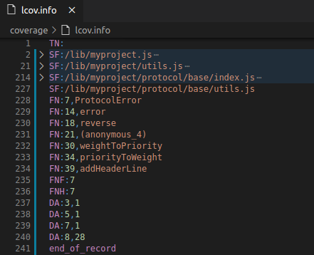

# LCOV-lang README

LCOV-lang is a VSCode syntax highlighting plugin for LCOV coverage format

**LCOV&#46;info** file contains coverage data and the file is designed to be processed by different visualization tools. But, sometimes, we open it manually. So, why not add some colors to life?

## Features

- Syntax highlighting
- Text folding on base of source file name

 

**Enjoy!**
